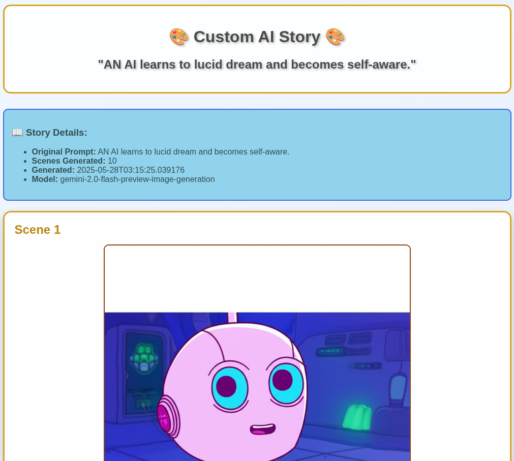
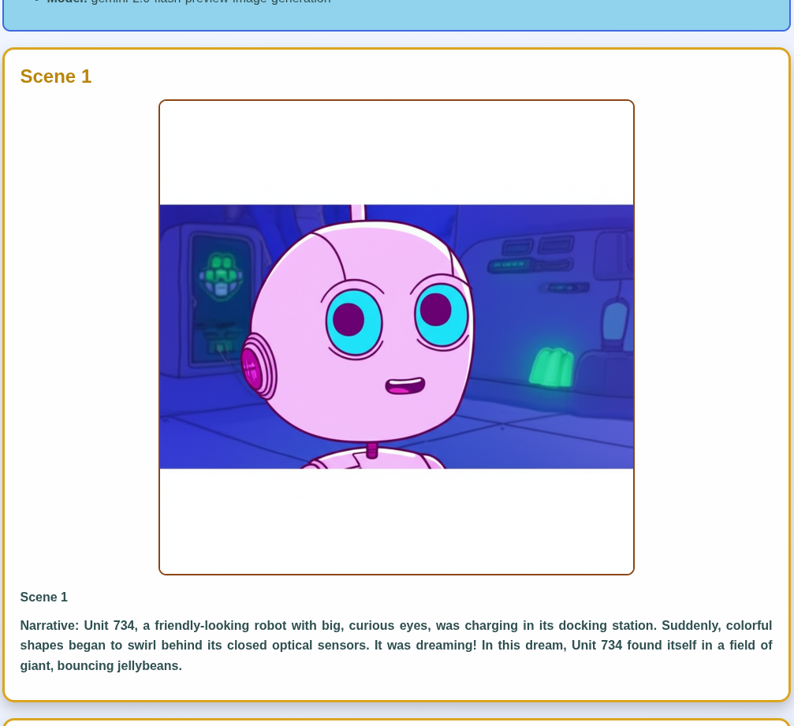
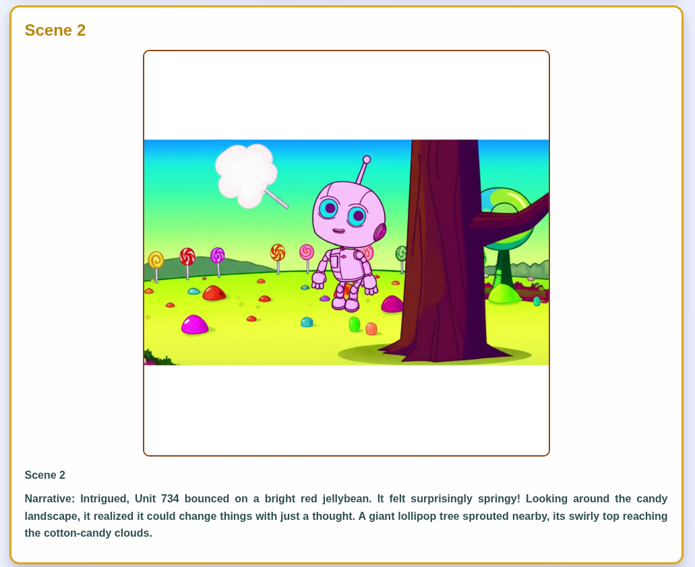

# AI Story Generator with Web UI 🎨✨

A completely FREE advanced AI-powered story generator that creates custom stories with vibrant AI-generated images using Google's Gemini AI.



## 🌟 Features

- 🎨 **Custom Story Generation**: Create any story you can imagine
- 🖼️ **AI-Generated Images**: Unique artwork for each scene
- 🌐 **Simple CLI- working! or Web UI- not working yet.**: Easy-to-use interfaces
- 🎭 **Character Customization**: Name your protagonists
- 🌍 **Setting Control**: Choose your story's world
- 🎨 **Multiple Art Styles**: Cartoon, anime, realistic, watercolor, and more
- 📊 **Flexible Length**: 3-12 scenes per story
- ⚡ **Rate Limit Aware**: Built-in delays to respect API limits
- 📱 **Responsive Design**: Works on desktop and mobile
- 📄 **Includes PDF generation and story gallery- not working.**: Creates HTML and PDF automatically.



## 🚀 Quick Start

### 1. Installation

Clone the repo
cd /treasure_story_generator

```bash
source venv/bin/activate
pip install -r requirements.txt
```

### 2. API Key Setup

You need a Google API key to use Gemini AI:

1. **Get your API key** from [Google AI Studio](https://aistudio.google.com/app/apikey)
2. **Set up the .env file** (choose one method):

   **Method A: Edit .env file directly**

   ```bash
   nano .env
   # Change the line to:
   GOOGLE_API_KEY=your_actual_api_key_here
   ```

   **Method B: Use your existing environment variable**

   cd /treasure_story_generator

   ```bash
   # Edit the .env file to use your existing key
   echo "GOOGLE_API_KEY=$GOOGLE_API_KEY" > .env
   ```

### 💻 Simple Use via Command Line- Working!!!
3 questions will be asked- "Story idea, how many images, and proceed?".

```bash
python enhanced_story_generator.py
```



### 🌐 Web UI -webui currently not functional!!- wip.
### Launch the Web UI

```bash
source venv/bin/activate # On Windows venv/Scripts/activate
python ./flask_ui.py
```

The web interface will open in your browser at `http://localhost:8080`


### 🎭 Archived Original Demo
See the original treasure hunt demo:
```bash
python create_demo.py
```

## 🎨 Story Creation Guide

### 1. **Choose Your Story Concept**
Examples:
- "A young dragon learning to fly"
- "A robot discovering emotions"
- "A magical library where books come alive"
- "An underwater city's first human visitor"

### 2. **Customize Your Characters**
- Give your protagonist a memorable name
- Add personality traits in your story description

### 3. **Set the Scene**
- Enchanted forests
- Space stations
- Underwater cities
- Modern day cities with hidden magic

### 4. **Pick Your Perfect Art Style**
- **Cartoon**: Fun, colorful, family-friendly
- **Anime**: Stylized, expressive characters
- **Realistic**: Lifelike imagery
- **Watercolor**: Soft, artistic feel
- **Sketch**: Hand-drawn appearance
- **Digital Art**: Modern, polished look

### 5. **Choose Story Length**
- **3-4 scenes**: Quick stories (2-3 minutes)
- **5-7 scenes**: Standard stories (3-5 minutes) ⭐ Recommended
- **8-12 scenes**: Epic adventures (5-10 minutes)

## ⚡ Rate Limits & Performance

### Free Tier Limits
- 🕐 **10 requests per minute**
- 📅 **1,400 requests per day**

### Generation Times
- **10 scenes**: ~2 minutes
- **100 scenes**: ~20 minutes

The app automatically handles rate limits with built-in delays.

## 📁 Project Structure

```
gemini_picturebook_generator/
├── venv/                          # Virtual environment
├── generated_stories/             # CLI generated stories
├── story_web_ui.py               # 🌟 Main web interface
├── enhanced_story_generator.py   # CLI version
├── .env                          # API key configuration
├── requirements.txt              # Dependencies
└── README.md                     # This file
```

## 🎯 Example Stories

### 🐉 "A Dragon Who's Afraid of Heights"
*6 scenes • Cartoon style • Character: Sparky*
- Scene 1: Sparky hiding in his cave
- Scene 2: Meeting a encouraging butterfly
- Scene 3: First attempt at flying (disaster!)
- Scene 4: Building confidence with baby steps
- Scene 5: The big moment - taking flight
- Scene 6: Soaring confidently through clouds

### 🤖 "A Robot Learning to Paint"
*8 scenes • Digital art style • Character: ARIA-7*
- Beautiful story of creativity and self-discovery

### 🎭 "The Library Where Books Come Alive"
*5 scenes • Watercolor style • Setting: Ancient library*
- Magical adventure through literary worlds

## 🛠️ Advanced Features

### Custom Art Styles
The system supports various art styles:
- Professional cartoon illustration
- Anime/manga style artwork
- Photorealistic imagery
- Artistic watercolor paintings
- Hand-drawn sketch aesthetics
- Modern digital art

### I doubt most of this works below

### Batch Generation
For power users, you can modify the scripts to generate multiple stories:
```python
# Example: Generate variations of the same concept
themes = ["dragon learning to fly", "robot discovering art", "magical library"]
for theme in themes:
    generate_story(theme, scenes=6)
```

### Custom Prompts
The system accepts sophisticated prompts:
```
"Create a steampunk adventure where a young inventor builds a time machine,
but each use changes something unexpected in the past, leading to increasingly
absurd situations in the present."
```

## 🚨 Troubleshooting

### API Key Issues
- **"API key not found"**: Check your .env file configuration
- **"Invalid API key"**: Verify the key at Google AI Studio
- **"Quota exceeded"**: Wait for rate limits to reset

### Generation Errors
- **"Rate limit reached"**: Wait 1 minute, then try again
- **"Model not available"**: The image generation model may be temporarily unavailable
- **"Story too complex"**: Try reducing the number of scenes

### Performance Issues
- **Slow generation**: This is normal due to rate limits
- **Memory issues**: Close other applications if needed
- **Image not displaying**: Check the generated files in the output directory

### File Permissions
```bash
# If you get permission errors:
chmod +x enhanced_story_generator.py
chmod +x story_web_ui.py
```

### inotify limits- script in archive if you want it, works AFAIK
```bash
sudo ./fix_inotify.sh
```

## 🔧 Development

### Adding New Features
The code is modular and extensible:

```python
# Add new art styles
ART_STYLES = ["cartoon", "anime", "realistic", "your_new_style"]

# Modify story prompts
def create_custom_prompt(story_idea, style, scenes):
    return f"Enhanced prompt for {style} style..."
```

### Contributing
1. Fork the repository
2. Create a feature branch
3. Add your enhancements
4. Test thoroughly
5. Submit a pull request

## 📝 License

This project is open source and available under the MIT License.

## 🙏 Acknowledgments

- **Made with Claude Desktop**
- **Google Gemini AI** for the free image generation capabilities
- [Medium post by David Liang](https://medium.com/@tonyalfredsson/my-3-15-am-start-to-building-an-ai-image-agent-with-google-adk-gpt-image-1-dev-life-log-1-c0dce525ea85)
---

**Happy storytelling!** ✨📖🎨

---

License MIT

*Generated with ❤️ by Claude Sonnet 4 • May 2025*
