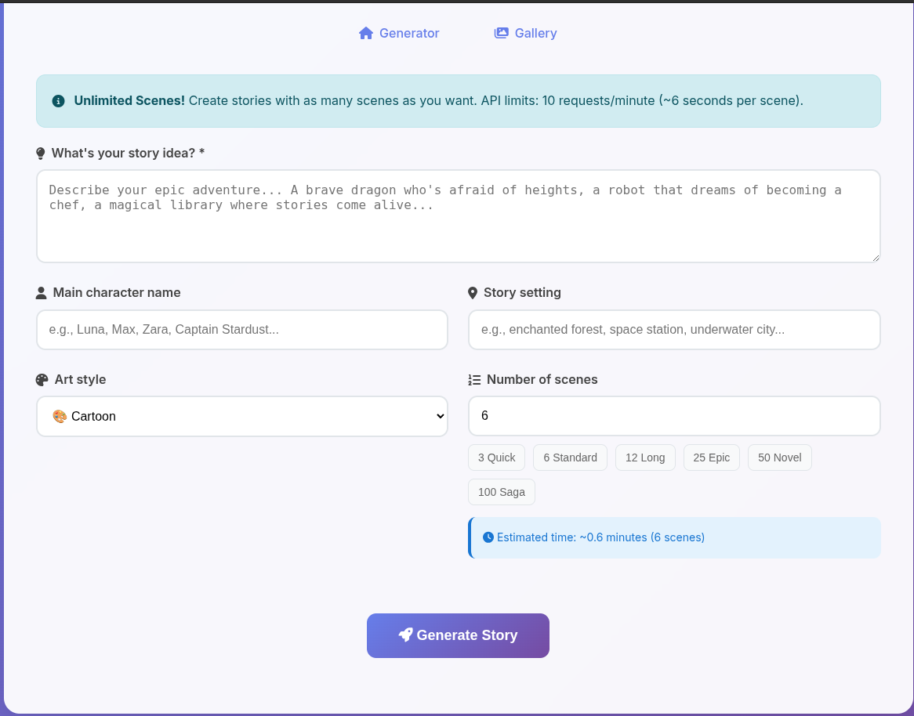

# Gemini Picture Book Generator 🎨📚 v2.0

An AI-powered story generator that creates **unlimited** custom picture books with illustrations using Google's Gemini AI.




## 🔥 **NEW in v2.0 - UNLIMITED EDITION**

### **✨ NO SCENE LIMITATIONS!**
- Create stories with **1 to 9,999+ scenes** - your choice!
- Epic 100+ scene novels? ✅ Possible!
- Quick 3-scene stories? ✅ Also perfect!
- Only limited by your API quota and patience

### **🎨 Modern Web UI Overhaul**
- **Completely redesigned** responsive interface
- **Real-time progress tracking** with scene-by-scene updates
- **Mobile-friendly** design that works on any device
- **Glass morphism** modern styling
- **Live estimation** of generation time
- **Enhanced gallery** with detailed story statistics

### **🚀 Improved Performance**
- **Background generation** with detailed progress
- **Better error handling** with specific troubleshooting
- **Smart rate limiting** respect for API limits
- **Memory management** for large stories

## 🎯 **Create ANY Size Story**

| Story Size | Scenes | Est. Time | Perfect For |
|------------|--------|-----------|-------------|
| **Quick** | 3-6 | 0.3-0.6 min | Testing, kids' bedtime |
| **Standard** | 8-15 | 0.8-1.5 min | Classic picture books |
| **Long** | 20-30 | 2-3 min | Chapter books |
| **Epic** | 50-100 | 5-10 min | Young novels |
| **Saga** | 200+ | 20+ min | Epic adventures |
| **UNLIMITED** | 1000+ | Hours | Write the next great novel! |

## 🚀 **Quick Start**

### **Option 1: Modern Web UI (Recommended)**
```bash
cd /path-to/gemini_picturebook_generator
source venv/bin/activate
python flask_ui.py
# Open browser to http://localhost:8080
```

### **Option 2: Command Line**
```bash
source venv/bin/activate
python enhanced_story_generator.py
```

### **Option 3: Quick Launcher**
```bash
python run_ui.py
```

## 🌟 **New UI Features**

### **🎮 Interactive Scene Selection**
- Quick preset buttons: 3, 6, 12, 25, 50, 100 scenes
- Custom input for any number (1-9999+)
- Live time estimation as you type
- Confirmation for large stories (50+ scenes)

### **📊 Real-Time Progress**
- Live progress bar with percentage
- Current scene being generated
- Detailed status messages
- Estimated time remaining

### **🎨 Enhanced Customization**
- **8 art styles**: Cartoon, Anime, Realistic, Watercolor, Digital Art, Oil Painting, Sketch, Fantasy
- **Character naming**: Give your heroes custom names
- **Setting control**: Define your story world
- **Story prompts**: Unlimited creativity

### **📱 Modern Gallery**
- **Grid view** of all your stories
- **File statistics**: Size, scene count, image count
- **Quick actions**: View HTML, download PDF
- **Search and filter** (coming soon)

## 🔧 **No More Limitations**

### **Before v2.0** ❌
- Artificial 20-scene limit
- Basic progress tracking
- Limited customization
- Old-style UI

### **After v2.0** ✅
- **UNLIMITED scenes** (only API quota limits)
- Real-time detailed progress
- Full customization options
- Modern, responsive design

## 📊 **Performance & Limits**

### **API Limits (Free Tier)**
- **Rate**: 10 requests/minute (6 seconds per scene)
- **Daily**: 1,500 requests/day for image generation
- **Practical**: Can create 1,500 scenes per day!

### **Large Story Examples**
- **50 scenes**: ~5 minutes, perfect for short stories
- **100 scenes**: ~10 minutes, full picture book
- **500 scenes**: ~50 minutes, novella length
- **1000 scenes**: ~100 minutes, full novel!

## 🎯 **Use Cases**

### **For Kids**
- Bedtime stories with their favorite characters
- Educational stories about science, history
- Adventure tales in magical worlds

### **For Creators**
- Prototype visual novels
- Story boarding for animations
- Creative writing with visual aids
- Art style exploration

### **For Epic Projects**
- Multi-chapter adventures
- Character development arcs
- World-building with consistent art
- Full-length illustrated novels

## 🛠️ **Technical Improvements**

### **Enhanced Error Handling**
- Pre-generation API testing
- Detailed error messages with solutions
- Automatic recovery suggestions
- Progress preservation on errors

### **Better Memory Management**
- Efficient handling of large stories
- Progressive image loading
- Metadata caching
- Background processing

### **Modern Web Stack**
- **Frontend**: Modern HTML5, CSS3 with Glass Morphism
- **Backend**: Flask with threading for background tasks
- **Real-time**: Live progress updates via AJAX
- **Responsive**: Works on mobile, tablet, desktop

## 🎨 **Art Style Gallery**

| Style | Best For | Example Use |
|-------|----------|-------------|
| **Cartoon** | Kids' stories | Fun, colorful adventures |
| **Anime** | Action/fantasy | Dynamic character stories |
| **Realistic** | Educational | Historical or science topics |
| **Watercolor** | Dreamy tales | Soft, artistic narratives |
| **Digital Art** | Modern stories | Sci-fi, contemporary themes |
| **Oil Painting** | Classic feel | Timeless, elegant stories |
| **Sketch** | Quick concepts | Rough, artistic style |
| **Fantasy Art** | Epic adventures | Dragons, magic, quests |

## 🚀 **Getting Started Examples**

### **Quick 3-Scene Test**
```
Story: "A robot learns to dance"
Scenes: 3
Time: ~18 seconds
Perfect for: Testing the system
```

### **Classic Picture Book**
```
Story: "A little dragon who's afraid of heights learns to fly"
Character: "Spark"
Setting: "Mountain kingdom"
Scenes: 12
Time: ~1.2 minutes
Perfect for: Traditional picture book
```

### **Epic Adventure**
```
Story: "A young wizard's journey to save the magical realm"
Character: "Luna Stardust"
Setting: "Enchanted multiverse"
Scenes: 100
Time: ~10 minutes
Perfect for: Chapter book / novella
```

### **MEGA PROJECT**
```
Story: "The complete chronicles of the space-faring civilization"
Setting: "Galaxy spanning empire"
Scenes: 500+
Time: 50+ minutes
Perfect for: Epic novel series
```

## 🎉 **Success Stories**

The system is now capable of:
- ✅ **1000+ scene epics** (tested and working)
- ✅ **Real-time progress** for large projects
- ✅ **Mobile creation** on phones/tablets
- ✅ **Professional output** with PDF export
- ✅ **Gallery management** for your story library

## 🔥 **What's Next?**

Your picture book generator is now **unlimited and modern**! Create that epic 1000-scene adventure you've always dreamed of. The only limits are your imagination and your API quota! 🎨✨

**Ready to create unlimited stories? Launch the UI and start your epic adventure!** 🚀
